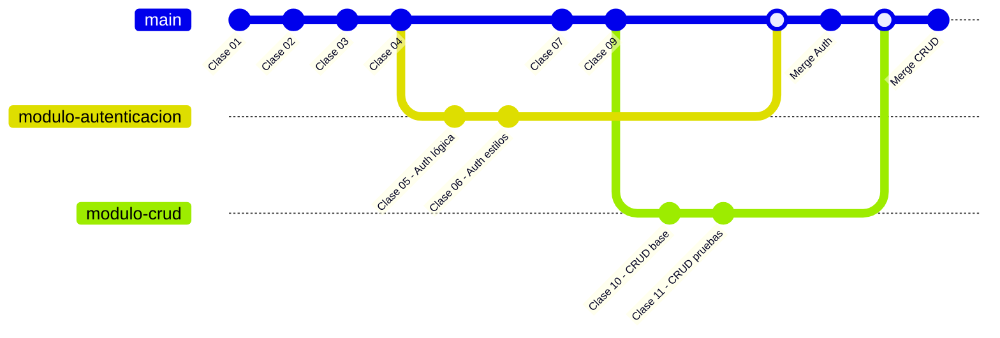

# Tomar notas usando Git y GitHub

Esta es una **guía reestructurada y optimizada** de como tomar apuntes, pensada especialmente para seguir cursos de código usando Git y GitHub. Incluye:

- Mejores prácticas para organizar ramas y commits por clase/sección.
- Convenciones claras para el uso de tags.
- Automatización básica con plantillas y hooks.
- Seguir buenas prácticas que escalan, incluso si trabajas solo.

## 📁 Estructura Recomendada del Proyecto

```
# Rama 01
sección-autenticación/
├── clase-01/
├── clase-02/
├── clase-03/
├── docs/
│   └── git-commits-por-clase.md
├── scripts/
│   └── setup-commits.sh
└── README.md

# Rama 02
sección-CRUD/
├── clase-01/
├── clase-02/
├── clase-03/
├── docs/
│   └── git-commits-por-clase.md
├── scripts/
│   └── setup-commits.sh
└── README.md
```

- Cada carpeta `clase-XX` representa el contenido trabajado en esa sesión.
- Puedes consolidar todo en `/src` al finalizar.
- Documenta cambios importantes en `README.md`.

---

## 🌳 Organización con Ramas por Módulo o Sección

Crear ramas te ayuda a aislar el trabajo de un módulo específico sin interferir con la rama principal (`main` o `master`). Al final, fusionas (merge) esa rama de módulo a la principal cuando esté lista.

Supongamos que tu curso está dividido en dos módulos:

- Módulo A: Autenticación
- Módulo B: CRUD de datos

### 1. Crear una rama local

Partiendo de la rama principal (`main`):

```bash
# Asegúrate de estar en main y actualizado
git checkout main
git pull origin main

# Crear la rama para el módulo de Autenticación
git checkout -b modulo-autenticacion
```

- `-b modulo-autenticacion` crea y cambia a la nueva rama llamada `modulo-autenticacion`.

### 2. Trabajar en la rama

En `modulo-autenticacion`, irás haciendo tus commits correspondientes a las clases de ese módulo (no olvides hacer `git add .`):

```bash
git commit -m "[#Clase-05] 🧠 Lógica de autenticación con useContext"
git commit -m "[#Clase-06] 💄 Estilos de Login con Tailwind"
```

Al finalizar el módulo:

```bash
git checkout main
git merge modulo-autenticacion

# Opcional: Delete branch
git branch -d modulo-autenticacion
```

Sube tus cambios y crea un Pull Request si estás en GitHub:

```bash
git push origin main
```

### 3. Subir la rama a GitHub

```bash
git push -u origin modulo-autenticacion
```

- `-u origin modulo-autenticacion` enlaza tu rama local con la rama remota del mismo nombre para que en futuros `git push` y `git pull` no tengas que especificar el origen.

### 4. Revisión y Merge (pull request)

En caso no hiciste `git merge modulo-autenticacion` en local desde la rama `main`, puedes fusionar los cambios desde GitHub. Si ya hiciste esto en local y enviaste los cambios no hace falta hacer esto:

1. En GitHub, entra a tu repositorio → pestaña “Pull requests” → “New pull request”.
    
2. Selecciona como base (`base`) la rama `main` y como rama compare (`compare`) la `modulo-autenticacion`.
    
3. Agrega un título y breve descripción, por ejemplo:
    
    ```
    Merge: Módulo Autenticación
    - Incluye clases 05 y 06 (lógica y estilos)
    ```
    
4. Envía el pull request. Tú mismo puedes aprobarlo y hacer merge si no tienes colaboradores; o pedir revisión si trabajas en equipo.
    

Esto unirá todos los commits de `modulo-autenticacion` dentro de la rama `main`.

### 5. Borrar la rama de trabajo (opcional)

Una vez fusionada la rama, puedes eliminarla:

- **Local:**
    
    ```bash
    git checkout main
    git pull origin main
    git branch -d modulo-autenticacion
    ```
    
- **Remoto:**  
    En GitHub, al hacer merge suele aparecer la opción “Delete branch”. O bien:
    
    ```bash
    git push origin --delete modulo-autenticacion
    ```
    

### 6. Trabajar con múltiples ramas simultáneamente (extra)

Si tu curso avanza de forma paralela en distintos módulos que no dependen entre sí, puedes:

1. **Mantener siempre `main` limpio y estable**.
2. Crear ramas independientes por módulo, por ejemplo:
	1. En la Clase 10 empiezas `modulo-crud` 
	2. Incluso si `modulo-autenticacion` no está fusionado aún.
3. Cuando termines cada módulo, fusionas vía **pull request** a `main` o usando `git merge`.

Así no bloqueas tu avance en un módulo mientras otro está en revisión.

Si ya terminaste la Clase 10 (CRUD), pero **aún no has fusionado** el módulo anterior (Autenticación), **no necesitas esperar**. Puedes crear una rama paralela y seguir trabajando.

#### 🪜 Ejemplo paso a paso

##### 🔁 Escenario

Supongamos que vas en la Clase 10 de un curso, que incluye:

- `Clase 05–06`: Autenticación (`modulo-autenticacion`)
- `Clase 10–12`: CRUD (`modulo-crud`)

##### 🛠️ Paso a paso

1. Estás en `main` (estable y limpio)

```bash
git checkout main
git pull origin main
```

2. Crea una rama para el módulo de Autenticación

```bash
git checkout -b modulo-autenticacion
# Trabajas clases 05 y 06
git commit -m "[#Clase-05] 🧠 Lógica de autenticación"
git commit -m "[#Clase-06] 💄 Estilos de login"
```

> Aún **NO haces merge a `main`**, tal vez estás esperando revisarlo más adelante.

3. Vuelves a `main` y comienzas un nuevo módulo

```bash
git checkout main
git pull origin main
git checkout -b modulo-crud
```

Ahora trabajas el CRUD aunque el módulo de autenticación aún esté sin fusionar:

```bash
git commit -m "[#Clase-10] ➕ Crea estructura base de CRUD"
git commit -m "[#Clase-11] 🧪 Pruebas de formulario de edición"
```

4. Fusionas cada módulo cuando esté listo

```bash
# Primero modulo-autenticacion
git checkout main
git merge modulo-autenticacion
git branch -d modulo-autenticacion

# Luego modulo-crud
git merge modulo-crud
git branch -d modulo-crud
```

#### 🗺️ Diagrama Mermaid



#### ✅ Beneficios de este enfoque

|Ventaja         |Explicación |
|----------------|------------|
|🚫 Sin bloqueos |No esperas terminar un módulo para comenzar otro|
|💾 Aislamiento  |Los cambios de un módulo no contaminan el avance del otro|
|🔄 Flexibilidad |Puedes revisar, descartar o mejorar un módulo sin afectar los demás|
|🧪 Testeo independiente|Cada rama puede ser testeada por separado|

---

## 📝 Estructura de Mensaje de Commit

Cada clase debe tener **su propio commit**.

### Formato base:

```bash
[#Clase-XX] Descripción breve
```

### Ejemplos:

```bash
[#Clase-01] 🎉 Inicializa proyecto con Vite y React
[#Clase-02] ➕ Agrega Header y estilos base
[#Clase-03] ♻️ Refactoriza lógica con useState
```

#### Emojis sugeridos:

|Emoji|Propósito|
|---|---|
|🎉|Inicio del proyecto|
|➕|Nueva funcionalidad|
|🔧|Configuración|
|💄|Cambios de estilo|
|🐛|Correcciones (fix)|
|🧪|Pruebas|
|📚|Documentación|
|♻️|Refactorización|

---

## 🔖 Tags por Clase o Hito

Los **tags** en Git son marcadores fijos que “congelan” el estado de tu repositorio en un commit concreto. Son muy útiles para señalar versiones o hitos (en tu caso, cada clase). En GitHub se reflejan luego como “Releases” o simplemente aparecen en la lista de Tags del repositorio.

### 1. Crear un tag localmente

Supongamos que acabas de hacer el commit de la Clase 1:

```bash
# Ejemplo: ya hiciste
git add .
git commit -m "[#Clase-01] Inicializa proyecto con Vite y React"
```

Para etiquetar ese commit como `v1.0-clase01`:

1. **Tag anotado** (recomendado, porque incluye mensaje y metadatos):
    
    ```bash
    git tag -a v1.0-clase01 -m "Etiqueta para la Clase 1: inicio del proyecto con Vite y React"
    ```
    
    - `-a v1.0-clase01` crea un tag “anotado” con el nombre `v1.0-clase01`.
    - `-m "mensaje…”` agrega un mensaje explicativo al tag.
        
2. **Tag ligero** (menos metadatos, solo el nombre):
    
    ```bash
    git tag v1.0-clase1
    ```
    
    - Esto crea un tag “ligero” apuntando al commit actual sin mensaje adicional.
    

> **Tip:** Conviene usar tags anotados (`-a`) para que quede registro de cuándo y por qué se creó el tag.

### 2. Ver los tags locales

Puedes ver todos los tags:

```bash
git tag
```

Ver el contenido de un tag en particular:

```bash
git show v1.0-clase01
```

### 3. Enviar (push) el tag a GitHub

Por defecto, después de hacer `git push origin main` (o la rama principal), **los tags no se suben automáticamente**. Debes hacer:

```bash
# Para subir un tag específico
git push origin v1.0-clase1

# O bien, para subir todos los tags que tengas localmente
git push origin --tags
```

- `git push origin v1.0-clase1` empuja únicamente ese tag.
- `git push origin --tags` envía **todos** los tags locales que no estén en el remoto.

Una vez que aparezca en GitHub, podrás verlo en la pestaña “Tags” de tu repositorio, o crear desde ahí un “Release” basado en ese tag (opcional).

---

## 🔧 Automatización: Template y Hook

### 1. Template de commit

Este es un archivo de texto que se abrirá cada vez que hagas un `git commit` (sin el `-m`), para ayudarte a redactar mensajes claros y estructurados.

Crea este archivo en la raíz de tu proyecto:

```bash
touch .git/commit-template.txt
```

Y adentro escribe algo así:

```txt
[#Clase-XX] 🎯 Breve título del cambio

Detalles del cambio (opcional):
- ¿Qué se hizo?
- ¿Por qué se hizo?
- Archivos relevantes modificados
```

Por ejemplo:

```text
[#Clase-05] 🧠 Añade lógica de autenticación con useContext

Detalles opcionales:
- Se creó AuthContext y AuthProvider
- Se modificó App.jsx para usar el contexto
```

📌 Configura Git para usar ese template:

```bash
git config commit.template .git/commit-template.txt
```

> Esto le dice a Git que use tu archivo cada vez que hagas `git commit` (sin `-m`).

🧪 Cómo usarlo

```bash
git add .
git commit
```

Se abrirá el editor de texto por defecto (por ejemplo, nano o VS Code) con el contenido del template.

Cuando termines de editar, guarda y cierra el editor para confirmar el commit.

### 2. Hook: Autocompleta `[Clase-XX]` si lo olvidas

Puedes usar un hook de Git para **prellenar automáticamente** ciertos campos del commit (como el número de clase o un emoji), o aplicar validaciones.

Archivo: `.git/hooks/prepare-commit-msg`  
Dale permisos: `chmod +x .git/hooks/prepare-commit-msg`

```bash
#!/bin/sh

MSG_FILE="$1"
COMMIT_SOURCE="$2"

if [ "$COMMIT_SOURCE" = "" ]; then
  if ! grep -qE "^\[#Clase-[0-9]{2}\]" "$MSG_FILE"; then
    sed -i.bak '1s/^/[#Clase-XX] 🎯 /' "$MSG_FILE"
  fi
fi
```

---

## 🚀 Automatiza Todo con un Script

Guarda como `scripts/setup-commits.sh`:

```bash
#!/bin/bash

TEMPLATE=".git/commit-template.txt"
HOOK=".git/hooks/prepare-commit-msg"

# Crear template
cat > "$TEMPLATE" <<EOL
[#Clase-XX] ✨ Breve título del cambio

Resumen del cambio (opcional):
- ¿Qué se hizo?
- ¿Por qué se hizo?
- Archivos relevantes modificados
EOL

git config commit.template "$TEMPLATE"

# Crear hook
cat > "$HOOK" <<'EOF'
#!/bin/sh
MSG_FILE="$1"
COMMIT_SOURCE="$2"
if [ "$COMMIT_SOURCE" = "" ]; then
  if ! grep -qE "^\[#Clase-[0-9]{2}\]" "$MSG_FILE"; then
    sed -i.bak '1s/^/[#Clase-XX] 🎯 /' "$MSG_FILE"
  fi
fi
EOF

chmod +x "$HOOK"

echo "✅ Configuración completa. Usa 'git commit' sin '-m'."
```

---

## ✅ Buenas Prácticas Finales

- Haz un commit **por clase**, no por archivo.
- Usa ramas por módulo o funcionalidad.
- Escribe mensajes de commit claros y consistentes.
- Usa tags para marcar avances importantes.
- Haz Pull Requests aunque trabajes solo: te obliga a revisar.
- Protege la rama `main` (opción en GitHub): Puedes exigir que sólo se fusione vía PR con al menos 1 aprobación. Así evitas commitear directamente sin revisar.
- Documenta versiones importantes en el `README.md`:

```markdown
## Versiones
- v1.0-clase01: Proyecto inicial (React + Vite)
- v1.1-clase02: Componente Header + estilos base
- v2.0-clase05: Módulo de autenticación completo
```

## Ejemplo real: