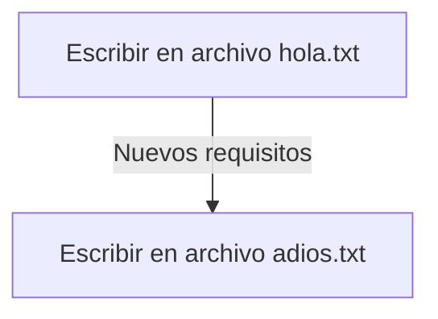

# Principios SOLID y Clean Code

## 1. Introducción

### 1.1 Introducción

### 1.2 ¿Cómo funcionará el curso?

### 1.3 ¿Cómo hacer preguntas?

### 1.4 ¿De qué se trata este curso?

### 1.5 Instalaciones necesarias

[Instalaciones recomendadas](https://gist.github.com/Klerith/5bd148b2e16325752219b68995ddf91b)

### 1.6 Principales referencias del curso

El curso cuenta con muchas referencias al libro:

**Clean JavaScript** de Miguel A. Gómez

Pueden comprar el libro si lo desean [aquí](https://cleanjavascript.es/)

IMPORTANTE:

No es necesario comprarlo, es una simple referencia por si quieren mayor información.

**Refactoring Guru:** Khmelnitske shosse  
**Sitio web:** [https://refactoring.guru/](https://refactoring.guru/)

Entre otros sitios web con referencias en las presentaciones que verán un poco más adelante.

### 1.7 Preparación del laboratorio de ejercicios

```bash
git clone git@github.com:Klerith/clean-course.git
mv clean-course clean-solid
```

Si quieres trabajar con `npm` en lugar de `yarn` primero elimina el archivo `yarn.lock`.

```bash
# Run
npm i
npm run dev
```

Cada sección tiene su rama: 

[Clean - SOLID - CodeSmells - Repo](https://github.com/Klerith/clean-course/tree/main)

### 1.8 Nota importante

Importante

Al finalizar el curso, les agradeceré que se tomen unos minutos para responder una corta encuesta y asi poder contar su retroalimentación de lo que les pareció el contenido del curso. Porqué al finalizarlo? Bueno, porque al calificarlo muy temprano o de forma prematura, es muy poco tiempo para tener una idea sobre lo que haremos y aprenderemos en el curso.

Sin más, espero difruten el contenido. 

Gracias!

atte:

Fernando Herrera

### 1.9 ¡Únete a Nuestra Comunidad de DevTalles en Discord!


Te invitamos a que formes parte de nuestra comunidad de DevTalles en Discord, un espacio donde tendrás la oportunidad de establecer conexiones con otros estudiantes, compartir y colaborar.

**¿Cómo unirse?**

- Haz clic en el siguiente enlace de invitación: [Comunidad DevTalles](https://discord.gg/pBjEVYTC7t)
- Una vez dentro, cuéntanos un poco de ti en el canal de bienvenida(#presentate).  

Estamos entusiasmados de tener nuevos miembros y crecer juntos como comunidad.

¡Esperamos verte pronto en Discord!

Atentamente,

El equipo de DevTalles

## 2. Clean Code y Deuda técnica

### 2.1 Introducción a la sección

Algo que debemos pagar después...

### 2.2 Temas puntuales de la sección

En esta sección estaremos hablando y haciendo ejercicios sobre:

- ¿Qué es la deuda técnica?  
- ¿Cómo se paga la deuda técnica?  
- Refactorización  
- Nombres de variables  
- Nombres para funciones  
- Ejercicios de refactorización  
- Principio DR

Esta sección procura que empecemos a escribir código que sea fácil de leer por nosotros y otros desarrolladores.

### 2.3 Breve exposición - Deuda técnica y Clean Code

Deuda Técnica

Es la falta de calidad en el código, que genera una deuda que repercutirá en costos futuros.

Costos económicos:

- Tiempo en realizar mantenimientos.
- Tiempo en refactorizar código.
- Tiempo en comprender el código.
- Tiempo adicional en la transferencia del código.

Esquema de deuda técnica de Martin Fowler

- Imprudente: No hay tiempo, solo copia y pega eso de nuevo.
- Inadvertido: ¿Qué son patrones de diseños?
- Prudente: Tenemos que entregar rápido ya refactorizaremos.
- Ahora sabemos cómo lo deberíamos haber hecho.

> Caer en deuda técnica es normal y a menudo es inevitable.

Refactorización

Es simplemente un proceso que tiene como objetivo mejorar el código sin alterar su comportamiento para que sea más entendible y tolerante a cambios.

Usualmente, para que una refactorización fuerte tenga el objetivo esperado, es imprescindible contar con pruebas automáticas.

> "Código Limpio es aquel que se ha escrito con la intención de que otra persona (o tú mismo en el futuro) lo entienda". - Carlos Blé  

> "Nuestro código tiene que ser simple y directo, debería leerse con la misma facilidad que un texto bien escrito". - Grady Booch  

> "Programar es el arte de decirle a otro humano lo que quieres que la computadora haga". - Donald Knuth

### 2.4 Nombres pronunciables y expresivos

Al crear variables:

- Tienen que estar en inglés
- Tienen que ser pronunciables
- Sin guiones bajos
- No ahorrar caracteres

```js
// Bad ❌
const n = 53;
const tx = 0.15;
const cat = 'T-Shirts';
const ddmmyyyy = new Date('August 15, 1965 00:00:00');
```

```js
// Better 👍
const numberOfUnits = 53;
const tax = 0.15;
const category = 'T-Shirts';
const birthDate = new Date('August 15, 1965 00:00:00');
```

```js
// Bad ❌
class AbstractUser {}
class UserMinin {}
class UserImplementation {}
interface UserInterface {}
```

```js
// Better 👍
class User {}
interface User {}
```

#### Ejercicio

```js
(() => {
  // Ejemplo
  // Archivos a evaluar - files to evaluate
  const filesToEvaluate = [
    { id: 1, flagged: false },
    { id: 2, flagged: false },
    { id: 3, flagged: true },
    { id: 4, flagged: false },
    { id: 5, flagged: false },
    { id: 7, flagged: true },
  ];

  // Archivos marcados para borrar - files to delete
  const filesToDelete = filesToEvaluate.map(
    (file) => file.flagged
  );

  // Bad
  class AbstractUser {}
  class UserMixin {}
  class UserImplementation {}
  interface IUser {}

  // Better
  class User {}
  interface User {}

  // Todo: Tarea

  // día de hoy - today
  const today = new Date();

  // días transcurridos - elapsed time in days
  const timeElapsedInDays: number = 23;

  // número de archivos en un directorio - number of files in directory
  const numberOfFilesInDirectory = 33;

  // primer nombre - first name
  const firstName = 'Fernando';

  // primer apellido - last name
  const lastName = 'Herrera';

  // días desde la última modificación - days since modification
  const daysSinceLastModification = 12;

  // cantidad máxima de clases por estudiante - max classes per student
  const maxClassesPerStudent = 6;
})();
```

[01- Ejercicio](https://gist.github.com/Klerith/625ef0d0a501f716ed5e3dbdf88396db)

### 2.5 Nombres según el tipo de dato

Arrays:

```js
// Bad ❌
const fruit = ["apple", "banana", "strawberry"];
```

```js
// Regular 👍
const fruitList = ["apple", "banana", "strawberry"];
```

```js
// Good ✅
const fruits = ["apple", "banana", "strawberry"];
```

```js
// Better 🐦‍🔥
const fruitName = ["apple", "banana", "strawberry"];
```

Booleans:

```js
// Bad ❌
const open = true;
const write = true;
const fruit = true;
const active = false;
const noValues = true;
const notEmpty = true;
```

```js
// Better 🐦‍🔥
const isOpen = true;
const canWrite = true;
const hasFruit = true;
const isActive = false;
const hasValues = false;
const isEmpty = false;
```

Number.

```js
// Bad ❌
const fruits = 3;
const cars = 10;
```

```js
// Better 🐦‍🔥
const maxFruits = 5;
const minFruits = 1;
const totalFruits = 3;
const totalOfCars = 5;
```

Functions:

```js
// Bad ❌
createUserIfNotExists();
updateUserIfNotEmpty();
sendEmailIfFieldsValid();
```

```js
// Better 🐦‍🔥
createUser();
updateUser();
sendEmail();
```

### 2.6 Ejercicio de nombres según tipo

```js
(() => {
  const celsiusTemperatures = [33.6, 12.34];
  const serverIp = '123.123.123.123';

  const users = [
    { id: 1, email: 'fernando@google.com' },
    { id: 2, email: 'juan@google.com' },
    { id: 3, email: 'melissa@google.com' },
  ];

  const userEmails = users.map((user) => user.email);

  const canJump = false;
  const canRun = true;
  const hasItems = true;
  const isLoading = false;

  const startTime = new Date().getTime();
  //....
  // 3 doritos después
  //...
  const endTime = new Date().getTime() - startTime;

  // Funciones
  function getBooks() {
    throw new Error('Function not implemented.');
  }

  function getBooksByUrl(url: string) {
    throw new Error('Function not implemented.');
  }

  function getSquareArea(side: number) {
    throw new Error('Function not implemented.');
  }

  function printJob() {
    throw new Error('Function not implemented.');
  }
})();
```

[02-name-type](https://gist.github.com/Klerith/7599f1637cc683ef59a03fd1c40d53d0)

### 2.7 Consideraciones para las clases

- El nombre es lo más importante de la clase.
- Formados por un sustantivo o frases de sustantivo.
- No deben de ser muy genéricos.
- Usar UpperCamelCase.

3 preguntas para determinar saber si es un buen nombre:

- ¿Qué exactamente hace la clase?
- Cómo exactamente esta clase realiza cierta tarea?
- Hay algo específico sobre su ubicación?

```js
// Bad ❌
class Manager {};
class Data {};
class Info {};
class Individual {};
class Processor {};
class SpecialMonsterView {};
```

Más palabras `!==` mejor nombre.

### 2.8 Nombres de funciones, argumentos y parámetros

Sabemos que estamos desarrollando código limpio cuando cada función hace exactamente lo que su nombre indica.

```js
//     Parameters 👀👇🏻
const sendEmail = (toWhom: string): boolean => {
  // Check email
  if (!toWhom.includes('@')) return false;

  // Body

  // Send email

  // if everything goes well
  return true;
};

// Arguments 👀👇🏻
sendEmail("aleroses@google.com");
```

Se recomienda limitar los parámetros a 3.

### 2.9 Ejercicio con funciones

```js
(() => {
  function getMovieById(id: string) {
    console.log({ id });
  }

  function getMovieCastById(id: string) {
    console.log({ id });
  }

  function getActorBioById(ActorId: string) {
    console.log({ ActorId });
  }

  interface Movie {
    cast: string[];
    description: string;
    rating: number;
    title: string;
  }

  function createMovie({
    title,
    description,
    rating,
    cast,
  }: Movie) {
    console.log({ title, description, rating, cast });
  }

  const checkFullName = (fullName: string): string => {
    return fullName === 'fernando' ? fullName : '';
  };

  function createActor(
    fullName: string,
    birthdate: Date
  ): boolean {
    // tarea asincrona para verificar nombre
    // ..
    // ..
    if (checkFullName(fullName)) return false;

    console.log('Crear actor', birthdate);
    return true;
  }
})();
```

[Ejercicio de funciones](https://gist.github.com/Klerith/d9278895ff5dcacf6f1001d447fb443a)

### 2.10 Detalles adicionales sobre funciones

Otras recomendaciones:

- Simplicidad es fundamental.
- Funciones de tamaño reducido.
- Funciones de una sola línea sin causar complejidad.
- Menos de 20 líneas.
- Evita el uso de "else".
- Prioriza el uso de la condicional ternaria.

```js
// Bad ❌
(() => {
  const getPayAmount = ({
    isDead = false,
    isSeparated = true,
    isRetired = false,
  }) => {
    let result;
    if (isDead) {
      result = 1500;
    } else {
      if (isSeparated) {
        result = 2500;
      } else {
        if (isRetired) {
          result = 3000;
        } else {
          result = 4000;
        }
      }
    }

    return result;
  };
})();
```

```js
// Better 🐦‍🔥
(() => {
  // Continue
  const getPayAmount = ({
    isDead = false,
    isSeparated = true,
    isRetired = false,
  }): number => {
    if (isDead) return 1500;
    if (isSeparated) return 2500;

    // if (isRetired)   return 3000;
    // return 4000;

    return isRetired ? 3000 : 4000;
  };
})();
```

[Función complicada](https://gist.github.com/Klerith/42d6d3a2ce5585d701afc67ca7a4a325)

### 2.11 Tarea - Refactorizar funciones

```js
// Bad ❌
(() => {
  (() => {
    // Resolver sin la triple condicional dentro del if
    // includes? arrays?
    function isRedFruit(fruit: string): boolean {
      if (
        fruit === 'manzana' ||
        fruit === 'cereza' ||
        fruit === 'ciruela'
      ) {
        return true;
      } else {
        return false;
      }
    }

    // Simplificar esta función
    // switch? Object literal? validar posibles colores
    function getFruitsByColor(color: string): string[] {
      if (color === 'red') {
        return ['manzana', 'fresa'];
      } else if (color === 'yellow') {
        return ['piña', 'banana'];
      } else if (color === 'purple') {
        return ['moras', 'uvas'];
      } else {
        throw Error('the color must be: red, yellow, purple');
      }
    }

    // Simplificar esta función
    let isFirstStepWorking = true;
    let isSecondStepWorking = true;
    let isThirdStepWorking = true;
    let isFourthStepWorking = true;

    function workingSteps() {
      if (isFirstStepWorking === true) {
        if (isSecondStepWorking === true) {
          if (isThirdStepWorking === true) {
            if (isFourthStepWorking === true) {
              return 'Working properly!';
            } else {
              return 'Fourth step broken.';
            }
          } else {
            return 'Third step broken.';
          }
        } else {
          return 'Second step broken.';
        }
      } else {
        return 'First step broken.';
      }
    }

    // isRedFruit
    console.log({
      isRedFruit: isRedFruit('cereza'),
      fruit: 'cereza',
    }); // true
    console.log({
      isRedFruit: isRedFruit('piña'),
      fruit: 'piña',
    }); // true

    //getFruitsByColor
    console.log({ redFruits: getFruitsByColor('red') }); // ['manzana', 'fresa']
    console.log({ yellowFruits: getFruitsByColor('yellow') }); // ['piña', 'banana']
    console.log({ purpleFruits: getFruitsByColor('purple') }); // ['moras', 'uvas']
    // console.log({ pinkFruits: getFruitsByColor('pink') }); // Error: the color must be: red, yellow, purple

    // workingSteps
    console.log({ workingSteps: workingSteps() }); // Cambiar los valores de la línea 31 y esperar los resultados
  })();
})();
```

[Tarea - Refactorizar funciones](https://gist.github.com/Klerith/b82113ad05830cd2880ec3bc1d0108ca)

### 2.12 Resolución de la tarea

```js
// Better 👍
(() => {
  // Resolver sin la triple condicional dentro del if
  // includes? arrays?
  function isRedFruit(fruit: string): boolean {
    let fruits: string[] = ['manzana', 'cereza', 'ciruela'];

    return fruits.includes(fruit);
  }

  // Simplificar esta función
  // switch? Object literal? validar posibles colores
  function getFruitsByColor(color: string): string[] {
    let fruitsByColor: Record<string, string[]> = {
      red: ['manzana', 'fresa'],
      yellow: ['piña', 'banana'],
      purple: ['moras', 'uvas'],
    };

    if (!fruitsByColor[color]) {
      throw Error('the color must be: red, yellow, purple');
    }

    return fruitsByColor[color];
  }

  // Simplificar esta función
  let isFirstStepWorking = true;
  let isSecondStepWorking = true;
  let isThirdStepWorking = true;
  let isFourthStepWorking = true;

  function workingSteps() {
    if (!isFirstStepWorking) return 'First step broken';
    if (!isSecondStepWorking) return 'Second step broken.';
    if (!isThirdStepWorking) return 'Third step broken.';
    if (!isFourthStepWorking) return 'Fourth step broken.';

    return 'Working properly!';
  }

  // isRedFruit
  console.log({
    isRedFruit: isRedFruit('cereza'),
    fruit: 'cereza',
  }); // true
  console.log({
    isRedFruit: isRedFruit('piña'),
    fruit: 'piña',
  }); // true

  //getFruitsByColor
  console.log({ redFruits: getFruitsByColor('red') }); // ['manzana', 'fresa']
  console.log({ yellowFruits: getFruitsByColor('yellow') }); // ['piña', 'banana']
  console.log({ purpleFruits: getFruitsByColor('purple') }); // ['moras', 'uvas']

  // Error...
  // console.log({ pinkFruits: getFruitsByColor('pink') }); // Error: the color must be: red, yellow, purple

  // workingSteps
  console.log({ workingSteps: workingSteps() }); // Cambiar los valores de la línea 31 y esperar los resultados
})();
```

También:

```ts
(() => {
  type FruitColor = 'red' | 'yellow' | 'purple';

  function getFruitsByColor(color: FruitColor): string[] {
    const fruitsByColor = {
      red: ['manzana', 'fresa'],
      yellow: ['piña', 'banana'],
      purple: ['moras', 'uvas'],
    };

    if (!Object.keys(fruitsByColor).includes(color)) {
      throw Error('The color must be: red, yellow, purple');
    }

    // if (!fruitsByColor[color]) {
    //   throw Error('The color must be: red, yellow, purple');
    // }

    return fruitsByColor[color];
  }
})();
```

`Record<string, string[]>` significa:

- las claves son `string`
- los valores son `string[]`

### 2.13 Principio DRY

"Si quieres ser un programador productivo, esfuérzate en escribir un código legible".

- Rober C. Martin

Don't Repeat Yourself

- Simplemente, es evitar tener duplicidad de código.
- Simplifica las pruebas.
- Ayuda a centralizar procesos.
- Aplicar el principio DRY, usualmente lleva a refactorizar.

`05.dry.ts`

```js
// Bad ❌
type Size = '' | 'S' | 'M' | 'XL';

class Product {
  constructor(
    public name: string = '',
    public price: number = 0,
    public size: Size = ''
  ) {}

  toString() {
    // No DRY
    if (this.name.length <= 0) throw Error('name is empty.');
    if (this.price <= 0) throw Error('price is zero.');
    if (this.size.length <= 0) throw Error('size is empty.');

    return `${this.name} (${this.price}), ${this.size}`;
  }
}

(() => {
  const bluePants = new Product('Blue Large Pants', 10, 'M');
  console.log(bluePants.toString());
})();
```

`main.ts`

```ts
import './style.css';
import './clean-code/05-dry';

const app = document.querySelector<HTMLDivElement>('#app')!;

app.innerHTML = `
  <h1>CleanCode y SOLID</h1>
  <span>Revisar la consola de JavaScript</span>
`;
```

### 2.14 Aplicando DRY

`05.dry.ts`

```js
// Better 👍
type Size = '' | 'S' | 'M' | 'XL';

class Product {
  constructor(
    public name: string = '',
    public price: number = 0,
    public size: Size = ''
  ) {}

  isProductReady(): boolean { 👈🏼👀👇🏻
    for (const key in this) {
      // console.log(key, typeof this[key]);
      const value = this[key];

      switch (typeof value) {
        case 'string':
          if (value.length <= 0)
            throw Error(`${key} is empty.`);
          break;

        case 'number':
          if (value <= 0) throw Error(`${key} is zero.`);
          break;

        default:
          throw Error(`${typeof this[key]} is not supported`);
      }
    }

    return true;
  }

  toString() {
    if (!this.isProductReady()) return; 👈🏼👀
    return `${this.name} (${this.price}), ${this.size}`;
  }
}

(() => {
  const bluePants = new Product('Blue Large Pants', 10, 'M');
  console.log(bluePants.toString());
})();
```

### 2.15 Código fuente de la sección

Descarga el código de la sección 2 [aquí](https://github.com/Klerith/clean-course/tree/fin-seccion-02)

## 3. Clean Code - Clases y Comentarios

### 3.1 Introducción a la sección

- Ver en Obsidian: [[poo-js#**1.** JavaScript orientado a objetos, basado en prototipos]]
- Ver en GitHub: [Curso Básico de POO con JS](https://github.com/aleroses/software-notes/blob/master/DW/2-intermedio/007.poo-js/poo-js.md)
- Ver en Obsidian: [[poo-js-intermedio#**1.** ¿Qué hay dentro de los objetos en JavaScript?]]
- Ver en GitHub: [Curso Intermedio de POO con JS](https://github.com/aleroses/software-notes/blob/master/DW/2-intermedio/008.poo-js-intermedio/poo-js-intermedio.md)

### 3.2 Temas puntuales de la sección

En esta sección hablaremos principalmente sobre clases y conceptos generales para escribir un mejor código.

Es importante tener presente que así como todo, hay excepciones a cada regla, pero esto debería ser un caso aislado y no el estándar. Tratemos de escribir un mejor código y dejar de lado la comodidad de hacer las cosas como se han venido haciendo, especialmente si esas cosas traen muchos problemas.

### 3.3 Breve introducción a las clases en TypeScript

`06.classes-a.ts`

```ts
(() => {
  type Gender = 'M' | 'F';

  class Person {
    public name: string;
    public gender: Gender;
    public birthdate: Date;

    constructor(
      name: string,
      gender: Gender,
      birthdate: Date
    ) {
      this.name = name;
      this.gender = gender;
      this.birthdate = birthdate;
    }
  }

  const newPerson = new Person(
    'Ale',
    'M',
    new Date('1985-10-21')
  );
  console.log({ newPerson });
})();
```

```js
// Better 👍
(() => {
  type Gender = 'M' | 'F';

  class Person {
    constructor(
      public name: string,
      public gender: Gender,
      public birthdate: Date
    ) {
      // this.name = name;
      // this.gender = gender;
      // this.birthdate = birthdate;
    }
  }

  const newPerson = new Person(
    'Ale',
    'M',
    new Date('1985-10-21')
  );
  console.log({ newPerson });
})();
```

`main.ts`

```ts
import './style.css';
import './clean-code/06.classes-a';

const app = document.querySelector<HTMLDivElement>('#app')!;

app.innerHTML = `
  <h1>CleanCode y SOLID</h1>
  <span>Revisar la consola de JavaScript</span>
`;
```

### 3.4 Herencia - Problemática

`06.classes-a.ts`

```js
// Bad ❌
(() => {
  // Without applying the principle of sole responsibility.
  type Gender = 'M' | 'F';

  class Person {
    constructor(
      public name: string,
      public gender: Gender,
      public birthdate: Date
    ) {}
  }

  class User extends Person {
    public lastAccess: Date;

    constructor(
      public email: string,
      public role: string,
      name: string,
      gender: Gender,
      birthdate: Date
    ) {
      super(name, gender, birthdate);
      this.lastAccess = new Date();
    }

    checkCredentials() {
      return true;
    }
  }

  class UserSettings extends User {
    constructor(
      public workingDirectory: string,
      public lastOpenFolder: string,
      email: string,
      role: string,
      name: string,
      gender: Gender,
      birthdate: Date
    ) {
      super(email, role, name, gender, birthdate);
    }
  }

  const userSettings = new UserSettings(
    '/usr/home',
    'home',
    'aleroses@google.com',
    'Admin',
    'Ale',
    'M',
    new Date('1985-10-21')
  );

  console.log({
    userSettings,
    areCredentialsValid: userSettings.checkCredentials(),
  });
})();
```

### 3.5 Objetos como propiedades

`06.classes-b.ts`

```js
(() => {
  // Without applying the principle of sole responsibility.
  type Gender = 'M' | 'F';

  interface PersonProps {
    birthdate: Date;
    gender: Gender;
    name: string;
  }

  class Person {
    public birthdate: Date;
    public gender: Gender;
    public name: string;

    constructor({ name, gender, birthdate }: PersonProps) {
      this.name = name;
      this.gender = gender;
      this.birthdate = birthdate;
    }
  }

  interface UserProps {
    birthdate: Date;
    email: string;
    gender: Gender;
    name: string;
    role: string;
  }

  class User extends Person {
    public email: string;
    public role: string;
    public lastAccess: Date;

    constructor({
      birthdate,
      email,
      gender,
      name,
      role,
    }: UserProps) {
      super({ name, gender, birthdate });
      this.lastAccess = new Date();
      this.email = email;
      this.role = role;
    }

    checkCredentials() {
      return true;
    }
  }

  interface UserSettingsProps {
    birthdate: Date;
    email: string;
    gender: Gender;
    lastOpenFolder: string;
    name: string;
    role: string;
    workingDirectory: string;
  }
  
  class UserSettings extends User {
    public workingDirectory: string;
    public lastOpenFolder: string;
    
    constructor({
      workingDirectory,
      lastOpenFolder,
      email,
      role,
      name,
      gender,
      birthdate,
    }: UserSettingsProps) {
      super({ email, role, name, gender, birthdate });
      this.workingDirectory = workingDirectory;
      this.lastOpenFolder = lastOpenFolder;
    }
  }

  const userSettings = new UserSettings({
    birthdate: new Date('1985-10-21'),
    email: 'aleroses@google.com',
    gender: 'M',
    lastOpenFolder: '/home',
    name: 'Ale',
    role: 'Admin',
    workingDirectory: '/usr/home',
  });

  console.log({
    userSettings,
    areCredentialsValid: userSettings.checkCredentials(),
  });
})();
```

`main.ts`

```ts
import './style.css';
import './clean-code/06.classes-b';

const app = document.querySelector<HTMLDivElement>('#app')!;

app.innerHTML = `
  <h1>CleanCode y SOLID</h1>
  <span>Revisar la consola de JavaScript</span>
`;
```

[06-classes-a.ts](https://gist.github.com/Klerith/787da77f48c6e513e8326ffe7bce059a)

### 3.6 Principio de responsabilidad única

`06.classes-c.ts`

```js
(() => {
  // Applying the principle of sole responsibility.
  // Prioritize composition over inheritance.

  type Gender = 'M' | 'F';

  interface PersonProps {
    birthdate: Date;
    gender: Gender;
    name: string;
  }

  class Person {
    public birthdate: Date;
    public gender: Gender;
    public name: string;

    constructor({ name, gender, birthdate }: PersonProps) {
      this.name = name;
      this.gender = gender;
      this.birthdate = birthdate;
    }
  }

  interface UserProps {
    email: string;
    role: string;
  }

  class User {
    public email: string;
    public lastAccess: Date;
    public role: string;

    constructor({ email, role }: UserProps) {
      this.lastAccess = new Date();
      this.email = email;
      this.role = role;
    }

    checkCredentials() {
      return true;
    }
  }

  interface SettingsProps {
    lastOpenFolder: string;
    workingDirectory: string;
  }

  class Settings {
    public workingDirectory: string;
    public lastOpenFolder: string;

    constructor({
      workingDirectory,
      lastOpenFolder,
    }: SettingsProps) {
      this.lastOpenFolder = lastOpenFolder;
      this.workingDirectory = workingDirectory;
    }
  }

  interface UserSettingsProps {
    birthdate: Date;
    email: string;
    gender: Gender;
    lastOpenFolder: string;
    name: string;
    role: string;
    workingDirectory: string;
  }

  class UserSettings { // 👈🏼👀
    public person: Person;
    public user: User;
    public settings: Settings;

    constructor({
      name,
      gender,
      birthdate,
      email,
      role,
      lastOpenFolder,
      workingDirectory,
    }: UserSettingsProps) { // 👈🏼👀👇🏼
      this.person = new Person({ name, gender, birthdate });
      this.user = new User({ email, role });
      this.settings = new Settings({
        lastOpenFolder,
        workingDirectory,
      });
    }
  }

  const userSettings = new UserSettings({
    birthdate: new Date('1985-10-21'),
    email: 'aleroses@google.com',
    gender: 'M',
    lastOpenFolder: '/home',
    name: 'Ale',
    role: 'Admin',
    workingDirectory: '/usr/home',
  });

  console.log({ userSettings });
})();
```

`main.ts`

```ts
import './style.css';
import './clean-code/06.classes-c';

const app = document.querySelector<HTMLDivElement>('#app')!;

app.innerHTML = `
  <h1>CleanCode y SOLID</h1>
  <span>Revisar la consola de JavaScript</span>
`;
```

El Principio de Responsabilidad Única (PRU) en TypeScript, parte de los principios SOLID, dice que **cada clase o módulo debe tener solo una razón para cambiar**, es decir, una única responsabilidad o tarea específica, como manejar datos, validar o interactuar con el DOM, para así crear código más modular, mantenible y fácil de probar, dividiendo clases grandes en otras más pequeñas y enfocadas.

[06-classes-b.ts](https://gist.github.com/Klerith/a5ea5db38b60149e2941fdce4248ecf5)

### 3.7 Tarea - Responsabilidad única

`07.tarea.ts`

```js
// Bad ❌
(() => {
  //* Aplicar el principio de responsabilidad única
  //* Priorizar la composición frente a la herencia

  type HtmlType = 'input' | 'select' | 'textarea' | 'radio';

  class HtmlElement {
    constructor(public id: string, public type: HtmlType) {}
  }

  class InputAttributes extends HtmlElement {
    constructor(
      public value: string,
      public placeholder: string,
      id: string
    ) {
      super(id, 'input');
    }
  }

  class InputEvents extends InputAttributes {
    constructor(
      value: string,
      placeholder: string,
      id: string
    ) {
      super(value, placeholder, id);
    }

    setFocus() {}
    getValue() {}
    isActive() {}
    removeValue() {}
  }

  //? Idea para la nueva clase InputElement

  const nameField = new InputEvents(
    'Fernando',
    'Enter first name',
    'txtName'
  );

  console.log({ nameField });
})();
```

`main.ts`

```js
import './style.css';
import './clean-code/07.tarea';

const app = document.querySelector<HTMLDivElement>('#app')!;

app.innerHTML = `
  <h1>CleanCode y SOLID</h1>
  <span>Revisar la consola de JavaScript</span>
`;
```

[Tarea - Responsabilidad única](https://gist.github.com/Klerith/8f69dd971ea830497cd3aa49bc9df51a)

### 3.8 Posible solución a la tarea

`07.tarea.ts`

```js
// Better 👍
(() => {
  //* Aplicar el principio de responsabilidad única
  //* Priorizar la composición frente a la herencia

  type HtmlType = 'input' | 'select' | 'textarea' | 'radio';

  class HtmlElement {
    constructor(public id: string, public type: HtmlType) {}
  }

  class InputAttributes {
    constructor(
      public value: string,
      public placeholder: string
    ) {}
  }

  class InputEvents {
    // constructor() {}

    setFocus() {}
    getValue() {}
    isActive() {}
    removeValue() {}
  }

  //? Idea para la nueva clase InputElement
  class InputElement {
    public html: HtmlElement;
    public attributes: InputAttributes;
    public events: InputEvents;

    constructor(
      value: string,
      placeholder: string,
      id: string
    ) {
      this.html = new HtmlElement(id, 'input');
      this.attributes = new InputAttributes(
        value,
        placeholder
      );
      this.events = new InputEvents();
    }
  }

  const nameField = new InputElement(
    'Fernando',
    'Enter first name',
    'txtName'
  );

  console.log({ nameField });
})();
```

Otra forma:

```ts
(() => {
  //* Aplicar el principio de responsabilidad única
  //* Priorizar la composición frente a la herencia

  type HtmlType = 'input' | 'select' | 'textarea' | 'radio';

  class HtmlElement {
    constructor(public id: string, public type: HtmlType) {}
  }

  interface Attributes {
    value: string;
    placeholder: string;
  }

  class InputAttributes {
    public value: string;
    public placeholder: string;

    constructor({ value, placeholder }: Attributes) {
      this.value = value;
      this.placeholder = placeholder;
    }
  }

  class InputEvents {
    constructor() {}

    setFocus() {}
    getValue() {}
    isActive() {}
    removeValue() {}
  }

  //? Idea para la nueva clase InputElement

  interface Props {
    id: string;
    type: HtmlType;
    value: string;
    placeholder: string;
  }

  class InputElement {
    public html: HtmlElement;
    public attributes: InputAttributes;
    public events: InputEvents;

    constructor({ id, type, value, placeholder }: Props) {
      this.html = new HtmlElement(id, type);
      this.attributes = new InputAttributes({
        value,
        placeholder,
      });
      this.events = new InputEvents();
    }
  }

  const nameField = new InputElement({
    id: 'Fernando',
    type: 'input',
    value: 'Enter first name',
    placeholder: 'txtName',
  });

  console.log({ nameField });
})();
```

### 3.9 Estructura recomendada de una clase

"El buen código parece estar escrito por alguien a quien le importa".

Michael Feathers

```js
class HtmlElement {
  // Comenzar con lista de propiedades
  // 1. Propiedades estáticas
  // 2. Propiedades públicas de último
  // 3. Propiedades privadas de último
  public static domReady: boolean = false;

  private _id: string;
  private type: string;
  private updatedAt: number;

  // Métodos
  // 1. Empezando por los constructores estáticos
  // 2. Luego el constructor
  // 3. Seguidamente métodos estáticos
  // 4. Métodos privados después
  // 5. Resto de métodos de instancia ordenados de mayor a menor importancia
  // 6. Getters y Setters al final

  static createInput(id: string) {
    return new HtmlElement(id, 'input');
  }

  constructor(id: string, type: string) {
    this._id = id;
    this.type = type;
    this.updatedAt = Date.now();
  }

  setType(type: string) {
    this.type = type;
    this.updatedAt = Date.now();
  }

  get id(): string {
    return this.id;
  }
}
```

### 3.10 Comentarios en el código

Es horrible leer código de otros.

Evita usar comentarios, pero...

> Cuando usamos librerías de terceros, APIS, frameworks, etc. nos encontraremos ante situaciones en las que escribir un comentario será mejor que dejar una solución compleja o un hack sin explicación.

Los comentarios deberían de ser la excepción, no la regla.

> "No comentes el código mal escrito, reescríbelo".  
> Brian W. Kernighan

Recuerda:  
Nuestro código debe de ser suficientemente autoexplicativo.

Lo que debemos comentar es:  
¿El por qué? en lugar del ¿Qué? o ¿Cómo?

### 3.11 Uniformidad en el proyecto

Problemas similares, soluciones similares.

```js
const createProduct = () => {};
const updateProduct = () => {};
const deleteProduct = () => {};

const createUser = () => {};
const updateUser = () => {};
const deleteUser = () => {};
```

```bash
componentes
├── product-list
└── product-item.ts
```

```bash
componentes
├── product-list
│   ├── product-list.html
│   └── product-list.ts
└── product-item.ts
```

```bash
componentes
├── product-item
│   └── product-item.ts
└── product-list
    ├── product-list.html
    └── product-list.ts
```

Indentación: yo uso 2 espacios :v

- Ver en Obsidian: [[prettier]]
- Ver en GitHub: [Prettier extension configuration](https://github.com/aleroses/software-notes/blob/master/DW/1-basico/003-prework/entorno-windows/vsc/prettier.md)
- [Smart Column Indenter](https://marketplace.visualstudio.com/items?itemName=lmcarreiro.vscode-smart-column-indenter)

### 3.12 Código fuente de la sección

Aquí les dejo el código de la sección, pero recuerden usar el suyo para conservar las anotaciones que ustedes hagan.

Usen el mío sólo para confirmar algo o tenerlo como respaldo.

Recursos de esta clase

[Código fuente de la sección](https://github.com/Klerith/clean-course/tree/fin-seccion-03)

---

## 4. Acrónimo - STUPID

### 4.1 Introducción a la sección

### 4.2 Temas puntuales de la sección

Esta es una sección corta y mayormente explicativa, en donde hablaremos sobre varios "code smells".

La idea es evitar a toda costa estos puntos que hacen que nuestro código pierda calidad.

### 4.3 CodeSmells - STUPID

El acrónimo **STUPID** en desarrollo de software describe **seis malas prácticas** que se deben evitar, representando: **S**ingleton (Singleton), **T**ight Coupling (Acoplamiento estrecho), **U**ntestability (Inestabilidad/No testeable), **P**remature Optimization (Optimización prematura), **I**ndescritive Naming (Nomenclatura indescriptible), y **D**uplication (Duplicación). Se usa como contraste a los principios **SOLID**, para crear código más limpio y mantenible. 

**Desglose de STUPID:**

- **S - Singleton**: Usar el patrón Singleton en exceso, creando clases que solo pueden tener una instancia, lo que dificulta las pruebas y acopla el código.
- **T - Tight Coupling (Acoplamiento estrecho)**: Clases que dependen demasiado unas de otras, haciendo difícil modificar una sin afectar a otras.
- **U - Untestability (Inestabilidad/No testeable)**: Código que es muy difícil o imposible de probar con pruebas unitarias automáticas.
- **P - Premature Optimization (Optimización prematura)**: Optimizar el código antes de que sea necesario, complicándolo sin necesidad.
- **I - Indescriptive Naming (Nomenclatura indescriptible)**: Usar nombres de variables, funciones o clases poco claros, que no reflejan su propósito.
- **D - Duplication (Duplicación)**: Código repetido en varias partes del programa, violando el principio DRY (Don't Repeat Yourself). 

**En contraste con KISS:**  
Existe otro acrónimo famoso en diseño y desarrollo llamado **KISS** (Keep It Simple, Stupid, "Mantenlo simple, estúpido"), que promueve la simplicidad y claridad en el diseño, mientras que STUPID identifica las características que complican el código.

`src/code-smells/01-singleton.js`

```js
const Singleton = (function () {
  let instance;

  function createInstance() {
    return new Object('I am the instance');
  }

  return {
    getInstance() {
      if (!instance) {
        instance = createInstance();
      }
      return instance;
    },
  };
})();

function main() {
  const instance1 = Singleton.getInstance();
  const instance2 = Singleton.getInstance();

  console.log('Misma instancia? ', instance1 === instance2);
}

main();
// Misma instancia?  true
```

`main.ts`

```js
import './style.css';
import './code-smells/01-singleton.js';

const app = document.querySelector<HTMLDivElement>('#app')!;

app.innerHTML = `
  <h1>CleanCode y SOLID</h1>
  <span>Revisar la consola de JavaScript</span>
`;
```

```bash
node src/code-smells/01-singleton.js
```

Pros:

Garantiza una única instancia de la clase a lo largo de toda la aplicación.

Contras:

- Vive en el contexto global.
- Puede ser modificado por cualquiera y en cualquier momento.
- No es rastreable.
- Difícil de testear debido a su ubicación.

[Ejemplo - Singleton](https://gist.github.com/Klerith/5fd1516d139e13b8355bedc15d1c8b7b)

Ver otro ejemplo: [[TypeScript_Tu-completa-guia-y-manual-de-mano#8.8 Constructores privados]]

### 4.4 Acoplamiento y cohesión

Alto acoplamiento:  
Lo ideal es tener bajo acoplamiento y buena cohesión.

Desventajas:

- Un cambio en un módulo por lo general provoca un efecto dominó de los cambios en otros módulos.
- El ensamblaje de módulos puede requerir más esfuerzo y/o tiempo debido a la mayor dependencia entre módulos.
- Un módulo en particular puede ser más difícil de reutilizar y/o probar porque se deben incluir módulos dependientes.

Posibles soluciones:

- A tiene un atributo que se refiere a B.
- A llama a los servicios de un objeto B.
- A tiene un método que hace referencia a B (a través del tipo de retorno o parámetro).
- A es una subclase de (o implementa) la clase B.

	"Queremos diseñar componentes que sean autocontenidos, autosuficientes e independientes. Con un objetivo y un propósito bien definido."  
	
	The Progmatic Programmmer

Cohesión  
Lo ideal es tener bajo acoplamiento y buena cohesión.

- La cohesión se refiere a lo que la clase (o módulo) puede hacer.
- La baja cohesión significaría que la clase realiza una gran variedad de acciones: es amplia, no se enfoca en lo que debe hacer.
- Alta cohesión significa que la clase se enfoca en lo que debería estar haciendo, es decir, solo métodos relacionados con la intención de la clase.

Acoplamiento  
Lo ideal es tener bajo acoplamiento y buena cohesión.

Se refiere a cuán relacionadas o dependientes son dos clases o módulos entre sí.

- En bajo acoplamiento, cambiar algo importante en una clase no debería afectar a la otra.
- En alto acoplamiento, dificultaría el cambio y el mantenimiento de su código; dado que las clases están muy unidas, hacer un cambio podría requerir una renovación completa del sistema.

```mermaid
flowchart LR
    subgraph Mala [❌ Alto acoplamiento]
        X1[m1] --> X2[m2] --> X3[m3]
        X1 --> Y1
        X2 --> Z1
        X3 --> Y2
    end

    subgraph Buena [✅ Bajo acoplamiento]
        subgraph A [Clase A]
            A1[m1] --> A2[m2]
        end

        subgraph B [Clase B]
            B1[m1] --> B2[m2]
        end

        A --> B
    end
```



“Cada clase presenta alta cohesión porque sus métodos colaboran entre sí para cumplir una única responsabilidad, y bajo acoplamiento porque la interacción entre clases es mínima y controlada.”

🧩 Alta cohesión

- Una clase o módulo:
    
    - Tiene **pocas responsabilidades**
    - Sus métodos están **relacionados entre sí**
    - Trabajan sobre **los mismos datos**

🔗 Bajo acoplamiento

- Una clase:
    
    - **Depende poco** de otras
    - Se comunica mediante **interfaces o contratos**
    - No conoce detalles internos de otras clases

👉 Visualmente:

- **Cohesión** → métodos “cerrados” dentro de la clase
- **Acoplamiento** → pocas flechas hacia afuera

### 4.5 Bajo acoplamiento y alta cohesión

`src/code-smells/02-high-coupling.ts`

```js
// Bad ❌
(() => {
  // No aplicando el principio de responsabilidad única
  type Gender = 'M' | 'F';

  // Alto Acoplamiento

  class Person {
    constructor(
      public firstName: string,
      public lastName: string,
      public gender: Gender,
      public birthdate: Date
    ) {}
  }

  class User extends Person {
    constructor(
      public email: string,
      public role: string,
      private lastAccess: Date,
      firstName: string,
      lastName: string,
      gender: Gender,
      birthdate: Date
    ) {
      super(firstName, lastName, gender, birthdate);
      this.lastAccess = new Date();
    }

    checkCredentials() {
      return true;
    }
  }

  class UserSettings extends User {
    constructor(
      public workingDirectory: string,
      public lastFolderOpen: string,
      email: string,
      role: string,
      firstName: string,
      lastName: string,
      gender: Gender,
      birthdate: Date
    ) {
      super(
        email,
        role,
        new Date(),
        firstName,
        lastName,
        gender,
        birthdate
      );
    }
  }

  const userSettings = new UserSettings(
    '/urs/home',
    '/development',
    'fernando@google.com',
    'F',
    'Fernando',
    'Roses',
    'M',
    new Date('1985-10-21')
  );

  console.log({
    userSettings,
    credentials: userSettings.checkCredentials(),
  });
})();
```

`src/code-smells/02-low-coupling.ts`

```js
// Better 👍
(() => {
  // Aplicando el principio de responsabilidad única
  // Prioriza la composición frente a la herencia

  type Gender = 'M' | 'F';

  interface PersonProps {
    firstName: string;
    lastName: string;
    gender: Gender;
    birthdate: Date;
  }

  class Person {
    public firstName: string;
    public lastName: string;
    public gender: Gender;
    public birthdate: Date;

    constructor({
      firstName,
      lastName,
      gender,
      birthdate,
    }: PersonProps) {
      this.firstName = firstName;
      this.lastName = lastName;
      this.gender = gender;
      this.birthdate = birthdate;
    }
  }

  interface UserProps {
    email: string;
    role: string;
  }
  class User {
    public email: string;
    public role: string;
    private lastAccess: Date;

    constructor({ email, role }: UserProps) {
      this.lastAccess = new Date();
      this.email = email;
      this.role = role;
    }

    checkCredentials() {
      return true;
    }
  }

  interface SettingsProps {
    lastFolderOpen: string;
    workingDirectory: string;
  }

  class Settings {
    public workingDirectory: string;
    public lastFolderOpen: string;

    constructor({
      workingDirectory,
      lastFolderOpen,
    }: SettingsProps) {
      this.workingDirectory = workingDirectory;
      this.lastFolderOpen = lastFolderOpen;
    }
  }

  // Nuevo User Settings
  interface UserSettingsProps {
    birthdate: Date;
    email: string;
    firstName: string;
    gender: Gender;
    lastFolderOpen: string;
    lastName: string;
    role: string;
    workingDirectory: string;
  }

  class UserSettings {
    // constructor(
    //     public person: Person,
    //     public user  : User,
    //     public settings: Settings,
    // ){}
    public person: Person;
    public user: User;
    public settings: Settings;

    constructor({
      firstName,
      lastName,
      gender,
      birthdate,
      email,
      role,
      workingDirectory,
      lastFolderOpen,
    }: UserSettingsProps) {
      this.person = new Person({
        firstName,
        lastName,
        gender,
        birthdate,
      });
      this.user = new User({ email, role });
      this.settings = new Settings({
        workingDirectory,
        lastFolderOpen,
      });
    }
  }

  const userSettings = new UserSettings({
    birthdate: new Date('1985-10-21'),
    email: 'fernando@google.com',
    gender: 'M',
    lastFolderOpen: '/home',
    lastName: 'Fernando',
    firstName: 'Roses',
    role: 'Admin',
    workingDirectory: '/usr/home',
  });

  console.log({
    userSettings,
    credentials: userSettings.user.checkCredentials(),
  });
})();
```

`src/main.ts`

```ts
import './style.css';
import './code-smells/02-high-coupling';
import './code-smells/02-low-coupling';

const app = document.querySelector<HTMLDivElement>('#app')!;

app.innerHTML = `
  <h1>CleanCode y SOLID</h1>
  <span>Revisar la consola de JavaScript</span>
`;
```

[Código inicial de la clase](https://gist.github.com/Klerith/1cdbbe863df646b043a437df97eebb01)

### 4.6 Code Smells adicionales

Untestability: código no probable (unit test).

Código dificilmente testeable

- Código con alto acoplamiento.
- Código con muchas dependencias no inyectadas.
- Dependencias en el contexto global (Tipo Singleton)

Debemos de tener en mente las pruebas desde la creación del código.

Optimizaciones prematuras

Mantener abiertas las opciones retrasando la toma de decisiones nos permite darle mayor relevancia a lo que es más importante en una aplicación.

No debemos anticiparnos a los requisitos y desarrollar abstracciones innecesarias que puedan añadir complejidad accidental.

Balance entre: 

- Complejidad esencial: La complejidad es inherente al problema.
- Complejidad accidental: Cuando implementamos una solución compleja a la mínima indispensable.

Nombres poco descriptivos:

- Nombres de variables mal nombradas.
- Nombres de clases genéricas.
- Nombres de funciones mal nombradas.
- Ser muy específico o demasiado genérico.

Duplicidad de Código:

No aplicar el principio DRY

Real

- Código es idéntico y cumple la misma función.
- Un cambio implicaría actualizar todo el código idéntico en varios lugares.
- Incrementa posibilidades de error humano al olvidar una parte para actualizar.
- Mayor cantidad de pruebas innecesarias.

Accidental

- Código luce similar, pero cumple funciones distintas.
- Cuando hay un cambio, solo hay que modificar un solo lugar.
- Este tipo de duplicidad se puede trabajar con parámetros u optimizaciones.

### 4.7 Otros olores honoríficos

- Inflación

Que es más importante:

- Que la computadora lea más rápido la información (rendimiento) o
- Que la persona pueda leer el código de forma clara el día de mañana

Es mejor dividir las clases.

- Obsesión primitiva

- Lista larga de parámetros

Más de 3 o 4 parámetros / argumentos en un método. Siempre será mejor pasa un objeto...

[Refactoring Guru](https://refactoring.guru/)

### 4.8 Acopladores

Todos los olores de este grupo contribuyen al acoplamiento excesivo entre clases o muestran lo que sucede si el acoplamiento se reemplaza por una delegación excesiva.

- Feature Envy: Un método accede a los datos de otro objeto más que a sus propios datos.
- Intimidad inapropiada: Cuando una clase usa campos y métodos internos de otra clase.
- Cadena de mensajes: Cuando una función A llama a B y a C.
- The middle man: Cuando una clase realiza solo una ación y esa acción es delegar el trabajo a otra clase.

### 4.9 Código fuente de la sección

Aquí les dejo el código de los ejercicios hasta el punto en que los tenemos en este momento.

Recursos de esta clase

[Fin sección 04](https://github.com/Klerith/clean-course/tree/fin-seccion-04)

## 5. Principios SOLID

### 5.1 Introducción a la sección

Son principios y no reglas.

Una regla es algo que se debe de cumplir y los principios solo son **recomendaciones**.

Violar un principio deberia ser algo muy aislado, no una norma.

### 5.2 Temas puntuales de la sección

En esta sección hablaremos al fin sobre los principios S.O.L.I.D.

Cada principio básicamente cuenta de 3 partes, una exposición, un ejercicio y cómo detectar violaciones al principio, algunos son bastante obvios y otros tienen un poco más de complejidad, pero no dejen que los nombres los asusten, son fáciles de comprender con la práctica.

Los **5 principios S.O.L.I.D.** de diseño de software son:

- S – Single Responsibility Principle (SRP)
- O – Open/Closed Principle (OCP)
- L – Liskov Substitution Principle (LSP)
- I – Interface Segregation Principle (ISP)
- D – Dependency Inversion Principle (DIP)

Y en esta sección hablaremos sobre cada uno de ellos.

### 5.3 Principios SOLID - SRP - Responsabilidad Única

Los principios de SOLID nos indican cómo organizar nuestras funciones y estructuras de datos en componentes y cómo dichos componentes deben estar interconectados.

- Single Responsibility: Responsabilidad única.
- Open and Close: Abierto y cerrado.
- Liskov Substitution: Sustitución de Liskov.
- Interface segregation: Segregación de interfaz.
- Dependency inversion: Inversión de dependencias.

#### SRP - Principio de responsabilidad única

"Nunca debería haber más de un motivo por el cual cambiar una clase o un módulo".

- Robert C. Martin

Una clase debe de tener una única responsabilidad. Tener más de una responsabilidad en nuestras clases o módulos hace que nuestro código sea difícil de leer, testear y mantener.

"Tener una única responsabilidad" !== "Hacer una única cosa"

### 5.4 Ejemplo de SRP

`src/solid/01-srp.ts`

```ts
// Bad ❌
(() => {
  interface Product {
    id: number;
    name: string;
  }

  // Usualmente, esto es una clase para controlar la vista que es desplegada al usuario
  // Recuerden que podemos tener muchas vistas que realicen este mismo trabajo.
  class ProductBloc {
    loadProduct(id: number) {
      // Realiza un proceso para obtener el producto y retornarlo
      console.log('Producto: ', { id, name: 'OLED Tv' });
    }

    saveProduct(product: Product) {
      // Realiza una petición para salvar en base de datos
      console.log('Guardando en base de datos', product);
    }

    notifyClients() {
      console.log('Enviando correo a los clientes');
    }

    onAddToCart(productId: number) {
      // Agregar al carrito de compras
      console.log('Agregando al carrito ', productId);
    }
  }

  const productBloc = new ProductBloc();

  productBloc.loadProduct(10);
  productBloc.saveProduct({ id: 10, name: 'OLED TV' });
  productBloc.notifyClients();
  productBloc.onAddToCart(10);
})();
```

```ts
// Better 👍
(() => {
  interface Product {
    id: number;
    name: string;
  }

  class ProductService {
    getProduct(id: number) {
      console.log('Producto: ', { id, name: 'OLED Tv' });
    }

    saveProduct(product: Product) {
      console.log('Guardando en base de datos', product);
    }
  }

  class Mailer {
    private masterEmail: string = 'ale@google.com';

    sendEmail(
      emailList: string[],
      template: 'to-clients' | 'to-admin'
    ) {
      console.log('Enviando correo a los clientes', template);
    }
  }

  // Usualmente, esto es una clase para controlar la vista que es desplegada al usuario
  // Recuerden que podemos tener muchas vistas que realicen este mismo trabajo.
  class ProductBloc {
    loadProduct(id: number) {
      // Realiza un proceso para obtener el producto y retornarlo
      console.log('Producto: ', { id, name: 'OLED Tv' });
    }

    saveProduct(product: Product) {
      // Realiza una petición para salvar en base de datos
      console.log('Guardando en base de datos', product);
    }

    notifyClients() {
      console.log('Enviando correo a los clientes');
    }
  }

  class CartBloc {
    private itemsInCart: Object[] = [];

    onAddToCart(productId: number) {
      // Agregar al carrito de compras
      console.log('Agregando al carrito ', productId);
    }
  }

  const productBloc = new ProductBloc();
  const cartBloc = new CartBloc();

  productBloc.loadProduct(10);
  productBloc.saveProduct({ id: 10, name: 'OLED TV' });
  productBloc.notifyClients();
  cartBloc.onAddToCart(10);
})();
```

`src/main.ts`

```ts
import './style.css';
import './solid/01-srp';

const app = document.querySelector<HTMLDivElement>('#app')!;

app.innerHTML = `
  <h1>CleanCode y SOLID</h1>
  <span>Revisar la consola de JavaScript</span>
`;
```

**B**usiness **Lo**gic **C**omponent, básicamente un patrón de diseño.

[Ejemplo de SRP](https://gist.github.com/Klerith/644f0dc4c898370308e029f15224f4f0)

### 5.5 Ejemplo de SRP - Segunda Parte

`src/solid/01-srp.ts`

```js
// Better 👍
(() => {
  interface Product {
    id: number;
    name: string;
  }

  class ProductService {
    getProduct(id: number) {
      console.log('Producto: ', { id, name: 'OLED Tv' });
    }

    saveProduct(product: Product) {
      console.log('Guardando en base de datos', product);
    }
  }

  class Mailer {
    private masterEmail: string = 'ale@google.com';

    sendEmail(
      emailList: string[],
      template: 'to-clients' | 'to-admin'
    ) {
      console.log('Enviando correo a los clientes', template);
    }
  }

  // Usualmente, esto es una clase para controlar la vista que es desplegada al usuario
  // Recuerden que podemos tener muchas vistas que realicen este mismo trabajo.
  class ProductBloc {
    private productService: ProductService;
    private mailer: Mailer;

    constructor(
      productService: ProductService,
      mailer: Mailer
    ) {
      this.productService = productService;
      this.mailer = mailer;
    }

    loadProduct(id: number) {
      this.productService.getProduct(id);
    }

    saveProduct(product: Product) {
      this.productService.saveProduct(product);
    }

    notifyClients() {
      this.mailer.sendEmail(['ale@google.com'], 'to-clients');
    }
  }

  class CartBloc {
    private itemsInCart: Object[] = [];

    onAddToCart(productId: number) {
      // Agregar al carrito de compras
      console.log('Agregando al carrito ', productId);
    }
  }

  const productService = new ProductService();
  const mailer = new Mailer();

  const productBloc = new ProductBloc(productService, mailer);
  const cartBloc = new CartBloc();

  productBloc.loadProduct(10);
  productBloc.saveProduct({ id: 10, name: 'OLED TV' });
  productBloc.notifyClients();
  cartBloc.onAddToCart(10);
})();
```

### 5.6 Detectar incumplimiento de SRP

SRP - Detectar violaciones

- Nombres de clases y módulos demasiado genéricos.
- Cambios en el código suelen afectar la clase o módulo.
- La clase involucra múltiples capas.
- Número elevado de importaciones (clases/módulos)
- Cantidad elevada de métodos públicos.
- Exceso número de línea de código.

### 5.7 OCP - Principio de abierto y cerrado

Open and Close: Abierto y cerrado.

Es un principio que depende mucho del contexto.

Establece que las entidades de software (clases, módulos, métodos, etc.) deben estar abiertas para la extensión, pero cerradas para la modificación, permitiendo añadir nueva funcionalidad sin alterar el código existente y así evitar errores y mejorar la mantenibilidad.

La forma más sencilla de demostrar este principio es considerar un método que hace una cosa.



```js
writeFile(fileName: string)

writeFile("hola.txt") writeFile("adios.txt");
```

El principio abierto-cerrado también se puede lograr de muchas otras maneras, incluso mediante el uso de la herencia o mediante patrones de diseño de composición como el patrón de estrategia.

¿Cómo funciona?

- **Abierto para extensión:** Puedes añadir nuevos comportamientos o características a tu clase o módulo.
- **Cerrado para modificación:** No necesitas cambiar el código fuente de la clase existente para implementar esas nuevas funcionalidades. 

¿Cómo se implementa?

- **Interfaces y Polimorfismo:** Definiendo interfaces claras y usando polimorfismo para que nuevas implementaciones se puedan enchufar sin tocar el código original.
- **Clases Abstractas:** Usando clases abstractas que definen un método, y luego creando clases concretas que heredan de ella e implementan ese método. 

Ejemplo Práctico

Imagina una clase `Calculadora` que suma. Si quieres añadir una función de resta sin modificar la clase `Calculadora` original, podrías crear una interfaz `Operacion` y una clase `Suma` que la implemente, y una `Resta` que también la implemente, permitiendo que tu código principal trabaje con la interfaz `Operacion` y pueda usar cualquiera de las dos sin cambios.

**En resumen:** El OCP es crucial para construir sistemas flexibles que se adapten a nuevos requisitos sin romper lo que ya funciona, basándose en la reutilización y la estabilidad del código.

### 5.8 Ejercicio de OCP

Estructura:

```bash
.
├── .DS_Store
├── favicon.svg
├── .gitignore
├── index.html
├── package.json
├── package-lock.json
├── README.md
├── src
│   ├── clean-code
│   │   ├── 01-names.ts
│   │   ├── 02.names-types.ts
│   │   ├── 03.functions.ts
│   │   ├── 04.homework.ts
│   │   ├── 05-dry.ts
│   │   ├── 06.classes-a.ts
│   │   ├── 06.classes-b.ts
│   │   ├── 06.classes-c.ts
│   │   ├── 07.delete.ts
│   │   ├── 07.tarea.ts
│   │   └── class.ts
│   ├── code-smells
│   │   ├── 01-singleton.js
│   │   ├── 02-high-coupling.ts
│   │   └── 02-low-coupling.ts
│   ├── main.ts
│   ├── solid 👀👇🏻
│   │   ├── 01-srp.ts
│   │   ├── 02-open-close-a.ts
│   │   ├── 02-open-close-b.ts
│   │   └── 02-open-close-c.ts
│   ├── style.css
│   └── vite-env.d.ts
└── tsconfig.json
```

`src/solid/02-open-close-a.ts`

```ts
import {
  PhotosService,
  PostService,
  TodoService,
} from './02-open-close-b';
import { HttpClient } from './02-open-close-c';

(async () => {
  const httpClient = new HttpClient();

  const todoService = new TodoService(httpClient);
  const postService = new PostService(httpClient);
  const photosService = new PhotosService(httpClient);

  const todos = await todoService.getTodoItems();
  const posts = await postService.getPosts();
  const photos = await photosService.getPhotos();

  console.log({ todos, posts, photos });
})();
```

`src/solid/02-open-close-b.ts`

```ts
// Hay que agregar la dependencia de axios ```yarn add axios```
// import axios from 'axios';

import { HttpClient } from './02-open-close-c';

export class TodoService {
  constructor(private http: HttpClient) {}

  async getTodoItems() {
    const { data } = await this.http.get(
      'https://jsonplaceholder.typicode.com/todos/'
    );
    return data;
  }
}

export class PostService {
  constructor(private http: HttpClient) {}

  async getPosts() {
    const { data } = await this.http.get(
      'https://jsonplaceholder.typicode.com/posts'
    );
    return data;
  }
}

export class PhotosService {
  constructor(private http: HttpClient) {}

  async getPhotos() {
    const { data } = await this.http.get(
      'https://jsonplaceholder.typicode.com/photos'
    );
    return data;
  }
}
```

`src/solid/02-open-close-c.ts`

```ts
import axios from 'axios';

export class HttpClient {
  async get(url: string) {
    const { data, status } = await axios.get(url);

    // console.log({ status });

    return { data, status };
  }
}
```

`src/main.ts`

```ts
import './style.css';
import './solid/02-open-close-a';

const app = document.querySelector<HTMLDivElement>('#app')!;

app.innerHTML = `
  <h1>CleanCode y SOLID</h1>
  <span>Revisar la consola de JavaScript</span>
`;
```

[Gist: Ejercicio Open and Close](https://gist.github.com/Klerith/6e23c35f9c00bf216ced71b04cfe4fbe)

### 5.9 Remover la dependencia de Axios

```bash
# Remover dependencias normales
npm uninstall <nombre-del-paquete>

# Remover dependencias de desarrollo (node_modules)
npm uninstall -D <nombre-del-paquete>
```

`src/solid/02-open-close-c.ts`

```js
export class HttpClient {
  async get(url: string) {
    const resp = await fetch(url);
    const data = await resp.json();

    return { data, status: resp.status };
  }
}
```

### 5.10 Detectar violaciones de OCP

Para detectar violaciones de SOLID, especialmente el **Principio Abierto/Cerrado (OCP)**, busca clases que se modifican constantemente para añadir nuevas funcionalidades (señal de que no están cerradas a cambios), uso excesivo de `if/else` o `switch` para manejar diferentes tipos, y la necesidad de cambiar múltiples clases para agregar algo nuevo; en general, la clase no está **abierta para extensión pero cerrada para modificación**, y las herramientas como **SonarQube** pueden ayudar a identificar patrones de violaciones automáticamente.

### 5.11 Principio de Substitución de Liskov

"Las funciones que utilicen punteros o referencias a clases base deben ser capaces de usar objetos de clases derivadas sin saberlo".

Robert C. Martin

"Siendo U un subtipo de T, cualquier instancia de T debería poder ser sustituida por cualquier instancia de U sin alterar las propiedades del sistema".

El Principio de Sustitución de Liskov (LSP) es un principio SOLID que dice que **las subclases deben poder sustituir a sus clases padre sin romper el programa**; es decir, si tienes una función que espera un objeto de una clase base, debe funcionar correctamente con cualquier objeto de una clase derivada sin que el comportamiento del código se altere, garantizando que las clases hijas no modifiquen o violen los contratos (métodos, precondiciones, postcondiciones) de la clase padre, como el famoso ejemplo del "Pato" que no puede volar.

Claves del LSP

- **Intercambiabilidad:** Los objetos de una subclase deben ser completamente sustituibles por objetos de la superclase.
- **Comportamiento consistente:** Las clases hijas deben heredar y mantener los comportamientos esperados de la clase padre.
- **No violar el contrato:** Una subclase no debe modificar el comportamiento de la clase padre de forma que el código que la usa falle. Esto incluye no lanzar excepciones nuevas no esperadas, no restringir los parámetros de entrada, y no cambiar las reglas de retorno. 

Ejemplo de violación (el Pato)

- **Clase Padre:** `Ave` con método `volar()`.
- **Subclase `Pato`:** Hereda `volar()`.
- **Problema:** Si `Pato` no puede volar, implementarlo vacío o lanzando un error viola el LSP, porque rompe el comportamiento esperado por el código que usa `Ave`.
- **Solución:** Replantear la jerarquía, quizás creando una clase `AveQueVuela`. 

¿Por qué es importante?

- **Previene errores:** Evita comportamientos inesperados y fallos en tiempo de ejecución al usar herencia.
- **Facilita el polimorfismo:** Permite usar objetos de distintas clases de forma uniforme.
- **Mejora el diseño:** Fomenta jerarquías de clases más robustas y lógicas.

### 5.12 Ejercicio - Substitución de Liskov

`src/solid/03-liskov-a.ts`

```js
// Bad ❌
import {
  Tesla,
  Audi,
  Toyota,
  Honda,
  Volvo,
} from './03-liskov-b';

(() => {
  const printCarSeats = (
    cars: (Tesla | Audi | Toyota | Honda | Volvo)[]
  ) => {
    for (const car of cars) {
      if (car instanceof Tesla) {
        console.log('Tesla', car.getNumberOfTeslaSeats());
        continue;
      }
      if (car instanceof Audi) {
        console.log('Audi', car.getNumberOfAudiSeats());
        continue;
      }
      if (car instanceof Toyota) {
        console.log('Toyota', car.getNumberOfToyotaSeats());
        continue;
      }
      if (car instanceof Honda) {
        console.log('Honda', car.getNumberOfHondaSeats());
        continue;
      }
      if (car instanceof Volvo) {
        console.log('Volvo', car.getNumberOfVolvoSeats());
        continue;
      }
    }
  };

  const cars = [
    new Tesla(7),
    new Audi(2),
    new Toyota(5),
    new Honda(5),
    new Volvo(2),
  ];

  printCarSeats(cars);
})();
```

`src/solid/03-liskov-b.ts`

```js
// Bad ❌
export class Tesla {
  constructor(private numberOfSeats: number) {}

  getNumberOfTeslaSeats() {
    return this.numberOfSeats;
  }
}

export class Audi {
  constructor(private numberOfSeats: number) {}

  getNumberOfAudiSeats() {
    return this.numberOfSeats;
  }
}

export class Toyota {
  constructor(private numberOfSeats: number) {}

  getNumberOfToyotaSeats() {
    return this.numberOfSeats;
  }
}

export class Honda {
  constructor(private numberOfSeats: number) {}

  getNumberOfHondaSeats() {
    return this.numberOfSeats;
  }
}

export class Volvo {
  constructor(private numberOfSeats: number) {}

  getNumberOfVolvoSeats() {
    return this.numberOfSeats;
  }
}
```

`src/main.ts`

```ts
import './style.css';
import './solid/03-liskov-a';

const app = document.querySelector<HTMLDivElement>('#app')!;

app.innerHTML = `
  <h1>CleanCode y SOLID</h1>
  <span>Revisar la consola de JavaScript</span>
`;
```

[Material para el ejercicio de LSP](https://gist.github.com/Klerith/f691b27c2a1d799e304fbae9a8ebc12b)

### 5.13 Solución aplicando los principios OCP y LSP

`src/solid/03-liskov-a.ts`

```ts
import {
  Tesla,
  Audi,
  Toyota,
  Honda,
  Volvo,
  Vehicle,
  Ford,
} from './03-liskov-b';

(() => {
  const printCarSeats = (cars: Vehicle[]) => {
    cars.forEach((car) => {
      console.log(
        car.constructor.name,
        car.getNumberOfSeats()
      );
    });
  };

  const cars = [
    new Tesla(7),
    new Audi(2),
    new Toyota(5),
    new Honda(5),
    new Volvo(2),
    new Ford(2),
  ];

  printCarSeats(cars);
})();
```

`src/solid/03-liskov-b.ts`

```js
export abstract class Vehicle {
  // getNumberOfSeats(): number {
  //   throw Error("Method not implemented!")
  // }

  abstract getNumberOfSeats(): number;
}

export class Tesla extends Vehicle {
  constructor(private numberOfSeats: number) {
    super();
  }

  getNumberOfSeats() {
    return this.numberOfSeats;
  }
}

export class Audi extends Vehicle {
  constructor(private numberOfSeats: number) {
    super();
  }

  getNumberOfSeats() {
    return this.numberOfSeats;
  }
}

export class Toyota extends Vehicle {
  constructor(private numberOfSeats: number) {
    super();
  }

  getNumberOfSeats() {
    return this.numberOfSeats;
  }
}

export class Honda extends Vehicle {
  constructor(private numberOfSeats: number) {
    super();
  }

  getNumberOfSeats() {
    return this.numberOfSeats;
  }
}

export class Volvo extends Vehicle {
  constructor(private numberOfSeats: number) {
    super();
  }

  getNumberOfSeats() {
    return this.numberOfSeats;
  }
}

export class Ford extends Vehicle {
  constructor(private numberOfSeats: number) {
    super();
  }

  getNumberOfSeats() {
    return this.numberOfSeats;
  }
}
```

### 5.14 Principio de segregación de interfaz

"Los clientes no deberían estar obligados a depender de interfaces que no utilicen".

Robert C. Martin

El Principio de Segregación de Interfaces (ISP) de SOLID dice que **los clientes no deben ser forzados a depender de métodos que no usan**, lo que significa que las interfaces deben ser pequeñas, específicas y enfocadas en un único rol o comportamiento, en lugar de grandes interfaces genéricas que obligan a las clases a implementar funcionalidades irrelevantes, promoviendo así un código más limpio, flexible y mantenible. 

En resumen:

- **Interfaces específicas:** En lugar de una interfaz `CRUD` gigante (Crear, Leer, Actualizar, Eliminar), crea interfaces más pequeñas como `IReader`, `IWriter`, `IDelete`, etc..
- **No obligar a implementar:** Una clase solo debe implementar los métodos que realmente necesita, evitando métodos vacíos o que lancen excepciones.
- **Evitar acoplamiento:** Reduce dependencias innecesarias, haciendo el sistema más robusto y fácil de modificar, como en el ejemplo de animales que no todos pueden correr o hablar. 

Ejemplo práctico (analogía):

Imagina un control remoto universal (gran interfaz) para todos los dispositivos (TV, DVD, Blu-ray). Si solo quieres controlar la TV, te ves obligado a lidiar con botones para DVD y Blu-ray que no usas (ISP violado). La solución es tener controles remotos separados para cada dispositivo (interfaces segregadas).

### 5.15 Ejercicio - Segregación de interfaz

`src/solid/04-segregation.ts`

```js
interface Bird {
  fly(): void;
  eat(): void;
  run(): void;
}

class Tucan implements Bird {
  public fly() {}
  public eat() {}
  public run() {}
}

class Humminbird implements Bird {
  public fly() {}
  public eat() {}
  public run() {}
}
```

### 5.16 Aplicar el principio de segregación de interfaz

`src/solid/04-segregation.ts`

```js
interface Bird {
  eat(): void;
}

interface FlyingBird {
  fly(): void;
}

interface RunningBird {
  run(): void;
}

interface SwimmerBird {
  swim(): void;
}

class Tucan implements Bird, FlyingBird {
  public fly() {}
  public eat() {}
}

class Humminbird implements Bird, FlyingBird {
  public fly() {}
  public eat() {}
}

class Ostrich implements Bird, RunningBird {
  public eat() {}
  public run() {}
}

class Penguin implements Bird, SwimmerBird {
  public eat() {}
  public swim() {}
}
```

### 5.17

```js
// Bad ❌
```

```js
// Better 👍

```

`src/main.ts`

```ts
```

```
```
🐦‍🔥
👀👇🏻
👈🏼👀

### 5.18

```js
// Bad ❌
```

```js
// Better 👍

```

```
```

```
```
🐦‍🔥
👀👇🏻
👈🏼👀

### 5.19

```js
// Bad ❌
```

```js
// Better 👍

```

```
```

```
```
🐦‍🔥
👀👇🏻
👈🏼👀

### 5.20

```js
// Bad ❌
```

```js
// Better 👍

```

```
```

```
```
🐦‍🔥
👀👇🏻
👈🏼👀

### 5.21

```js
// Bad ❌
```

```js
// Better 👍

```

```
```

```
```
🐦‍🔥
👀👇🏻
👈🏼👀

### 5.22

```js
// Bad ❌
```

```js
// Better 👍

```

```
```

```
```
🐦‍🔥
👀👇🏻
👈🏼👀